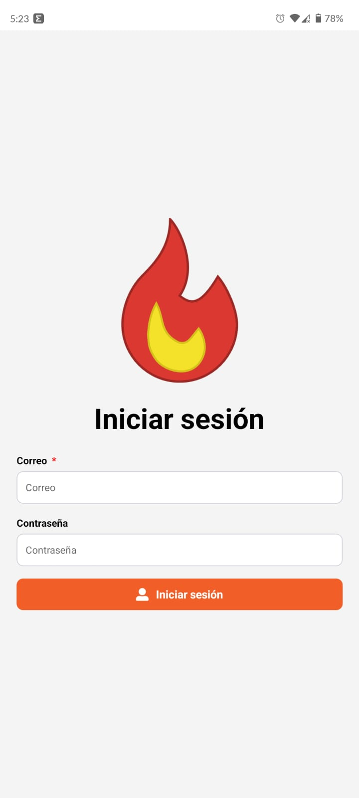
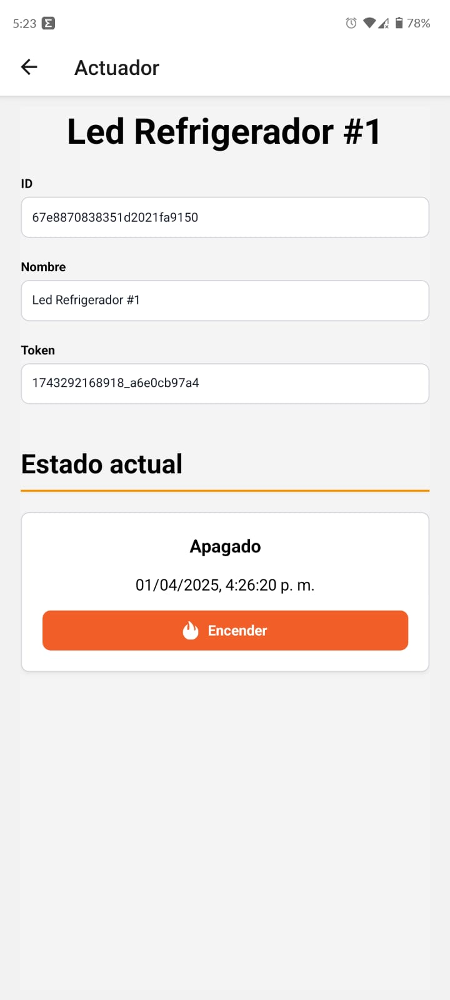

<h1 align="center">
  
   
  La Flamita
   
   
</h1>

  <!-- Web -->
  
  
  
  
  <!-- IoT -->
  
  

Web development using [`Express`](https://expressjs.com/) and [`React`](https://react.dev/) for `La Flamita Taqueria`. The solution focuses on developing the entire web infrastructure (views and `APIs`) for La Flamita's business logic.

This project is comprised of four submodules with different developments to meet different client requirements.

## Submodules 🧩

### [`la-flamita-admin`](https://github.com/InterdataUTJ/la-flamita-admin/) 🌐

This submodule contains all the development work for the web platform, including both the API and the views for accessing the administrative infrastructure through the browser.

It is developed using Express and integrates a MongoDB database. [`tailwindcss`](https://tailwindcss.com/) and [`flowbite`](https://flowbite.com/) are used as component libraries to develop the user interfaces.

#### Screenshots

### [`la-flamita-cliente`](https://github.com/InterdataUTJ/la-flamita-cliente/) 🌐

This submodule contains all the development work for the web platform, including both the `API` and the views for accessing the client infrastructure through the browser.

It is developed using `Express` and integrates a `MongoDB` database. [`tailwindcss`](https://tailwindcss.com/) and [`flowbite`](https://flowbite.com/) are used as component libraries to develop the user interfaces.

Unlike the administrative section, this section is solely for client use, allowing product listing and purchases using PayPal.

### [`la-flamita-iot`](https://github.com/InterdataUTJ/la-flamita-iot/) 💡

This submodule integrates the development carried out for IoT, which consists of a temperature sensor that periodically takes a reading and sends it to the `API` developed in the [`la-flamita-admin`](https://github.com/InterdataUTJ/la-flamita-admin/) submodule. Although it is designed to integrate with this project, the configuration tool allows the sensor to be configured for any `API` that accepts data in the sensor's transmission format.

The sensor is developed using an `ESP32` with the `Arduino IDE`. We also use the `DHT11` sensor to collect ambient data, and we use the `ESP32's` own hardware to send it via `WiFi`.

Additionally, another model was developed that uses a digital light sensor and communicates with the `DHT11` model via `BLE`.

### [`la-flamita-movil`](https://github.com/InterdataUTJ/la-flamita-movil/) 🤖

This submodule develops a mobile interface using React Native for employees to manage IoT devices.

This app allows users to register new devices, view sensor information, and manage the status of actuators.

To use IoT data and employee profiles, it uses the API developed in the [`la-flamita-admin`](https://github.com/InterdataUTJ/la-flamita-admin/) submodule.

#### Screenshots

## Team 👥

This project is developed by the school team `Interdata`, members of the career `Tecnico Superior Universitario Tecnologias de la Información Area Desarrollo de Software Multiplataforma`, commonly abbreviated as `TSU DSM`, at the `Universidad Tecnologica de Jalisco` (`UTJ`) at the headquarters of `Ciudad Creativa DIgital` (`CCD`).

### People

1. Cortés Gutiérrez Ismael ([`IsmaCortGtz`](https://github.com/IsmaCortGtz))
2. Fernandez Alonso Luis Geronimo ([`Geronimo1231`](https://github.com/Geronimo1231))
3. Gomez Magaña Ivan Martin ([`IvanGn`](https://github.com/IvanGn))
4. Lopez Maldonado Brian Alberto ([`Briansixo`](https://github.com/Briansixo))
5. Zepeda Jimenez Francisco Javier
