<h1 align="center">
  
   
  La Flamita
   
   
</h1>

  <!-- Web -->
  
  
  
  
  <!-- IoT -->
  
  

Desarrollo Web de [`Express`](https://expressjs.com/) y [`React`](https://react.dev/) para taquería la flamita. La solución se enfoca en desarrollar toda la infraestructura web (vistas y `APIs`) para la logica de negocios de `la-flamita`.

Este proyecto esta compuesto por 4 submodulos que cuentan con desarrollos diferentes para cubrir distintos requerimientos del cliente.

## Submodulos 🧩

### [`la-flamita-admin`](https://github.com/InterdataUTJ/la-flamita-admin/) 🌐

En este submodulo se encuentra todo el desarrollo de la plataforma web, tanto la `API` como las vistas para acceder a la infraestructura administrativa mediante el navegador.

Esta desarrollado utilizando `Express`, además integra una base de datos `MongoDB`. Para desarrollar las interfaces de usuario empleados [`tailwindcss`](https://tailwindcss.com/) y [`flowbite`](https://flowbite.com/) como libreria de componentes.

#### Capturas

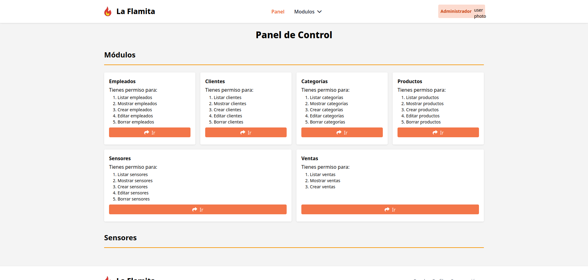
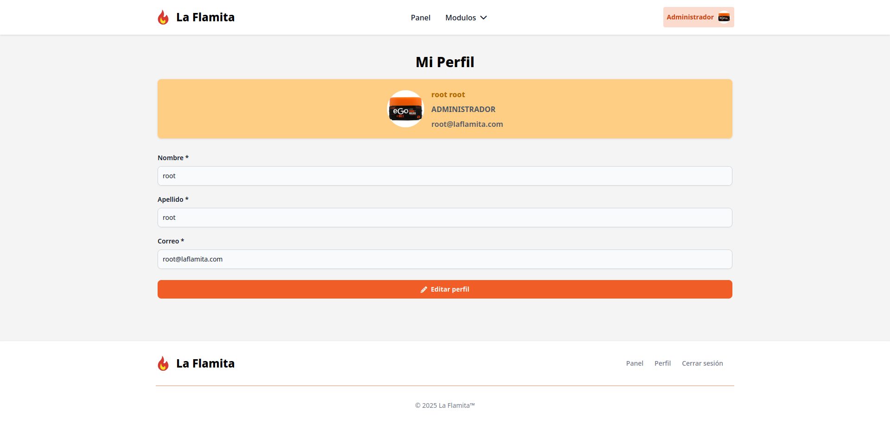
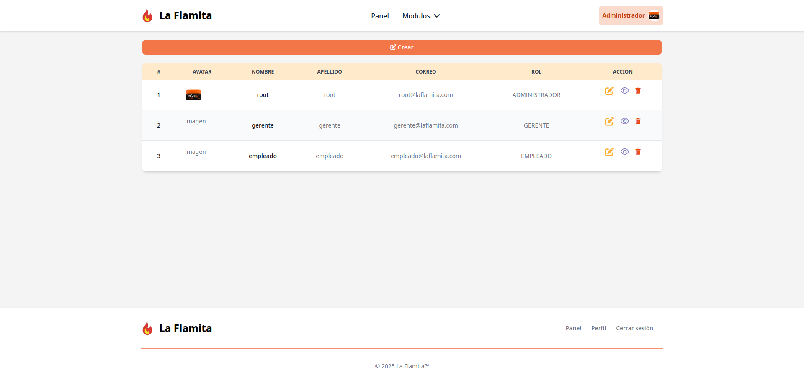
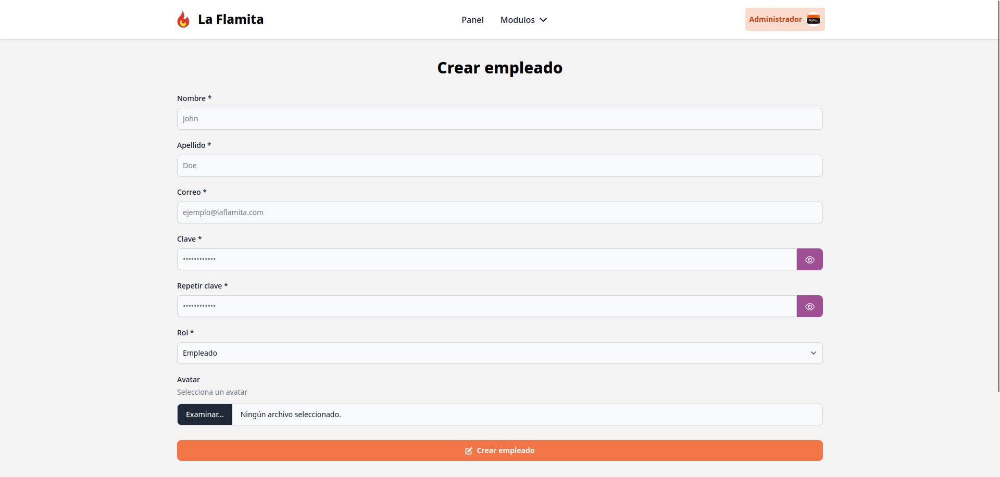
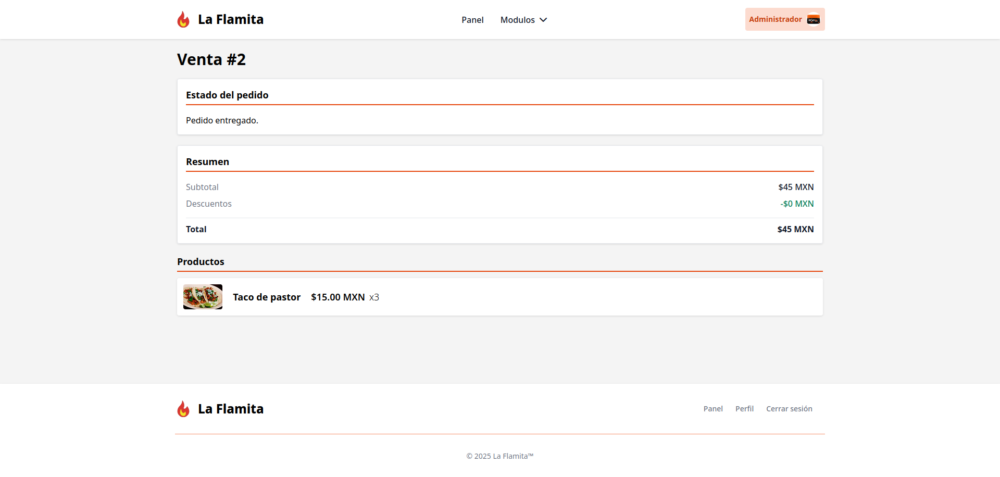

### [`la-flamita-cliente`](https://github.com/InterdataUTJ/la-flamita-cleinte/) 🌐

En este submodulo se encuentra todo el desarrollo de la plataforma web, tanto la `API` como las vistas para acceder a la infraestructura del cliente mediante el navegador.

Esta desarrollado utilizando `Express`, además integra una base de datos `MongoDB`. Para desarrollar las interfaces de usuario empleados [`tailwindcss`](https://tailwindcss.com/) y [`flowbite`](https://flowbite.com/) como libreria de componentes.

A diferencia de la sección administrativa, esta es meramente para uso de clientes, por lo que permite listar productos y realizar compras usando paypal.

### [`la-flamita-iot`](https://github.com/InterdataUTJ/la-flamita-iot/) 💡

Este submodulo integra el desarrollo realizado para IoT, el cual consta de un sensor de temperatura que cada cierto tiempo toma una lectura y la envia a la `API` desarrollada en el submodulo [`la-flamita-admin`](https://github.com/InterdataUTJ/la-flamita-admin/), a pesar de que esta pensado para integrarse con este proyecto, la herramienta de configuración permite configurar el sensor para cualquier `API` que acepte los datos en el formato de envio del sensor.

El sensor esta deasrrollado utilizando un `ESP32` con el `Arduino IDE`, además, utilizamos en sensor `DHT11` para la toma de datos del ambiente, y utilizamos el propio hardware del `ESP32` para enviarlos por `WiFi`.

Adicionalmente se desarrollo otro modelo que emplea un sensor de luz digital y se comunica con el modelo `DHT11` mediante `BLE`.

### [`la-flamita-movil`](https://github.com/InterdataUTJ/la-flamita-movil/) 🤖

Este submodulo desarrolla una interfaz movil mediante React Native para que los empleados puedan administrar los dispositivos IoT.

Esta app permite registrar nuevos dispositivos, consultar la información de los sensores y manejar el estado de los actuadores.

Para el uso de datos de IoT y perfil de empleado utiliza la API desarrollada en el submodulo [`la-flamita-admin`](https://github.com/InterdataUTJ/la-flamita-admin/).

#### Capturas

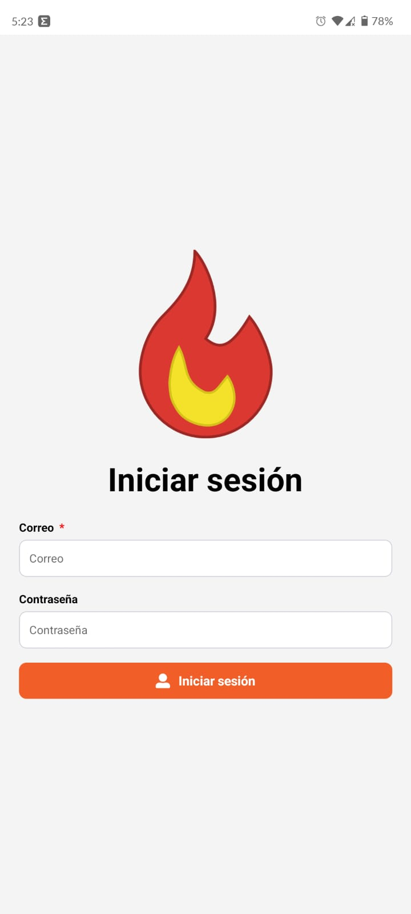
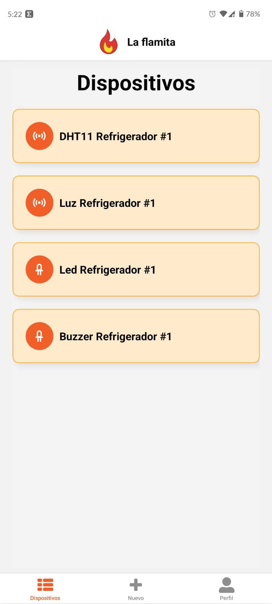
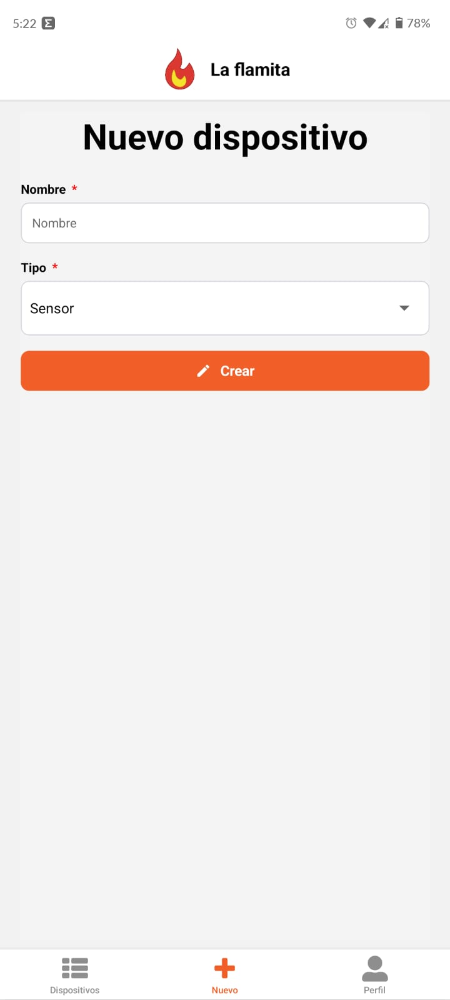
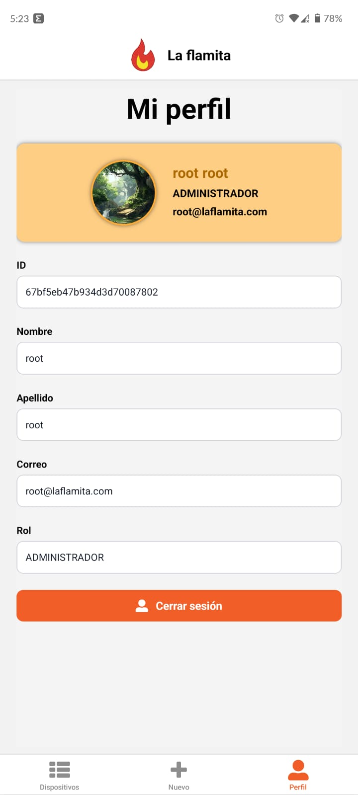
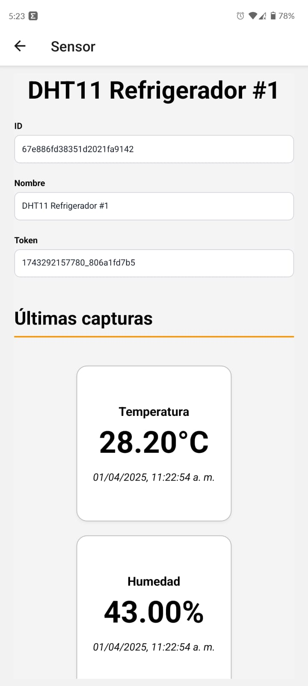
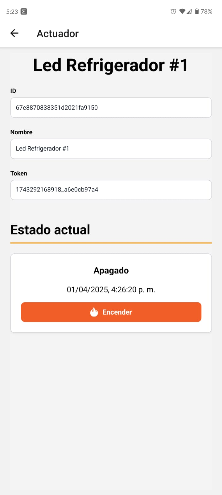

## Equipo 👥

Este proyecto esta desarrollado por el equipo escolar `Interdata`, miembros de la carrera `Tecnico Superior Universitario Tecnologias de la Información Area Desarrollo de Software Multiplataforma`, comunmente abreviado como `TSU DSM`, en la `Universidad Tecnologica de Jalisco` (`UTJ`) en la sede de `Ciudad Creativa DIgital` (`CCD`).

### Integrantes

1. Cortés Gutiérrez Ismael ([`IsmaCortGtz`](https://github.com/IsmaCortGtz))
2. Fernandez Alonso Luis Geronimo ([`Geronimo1231`](https://github.com/Geronimo1231))
3. Gomez Magaña Ivan Martin ([`IvanGn`](https://github.com/IvanGn))
4. Lopez Maldonado Brian Alberto ([`Briansixo`](https://github.com/Briansixo))
5. Zepeda Jimenez Francisco Javier
